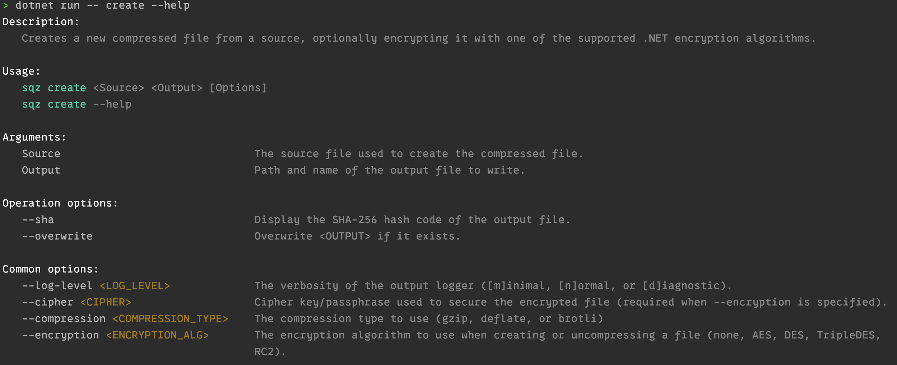

# vertical-cli

## Overview

The goal of the library is to be able to build verbose CLI applications where arguments can easily be mapped to types, and types can be shared across different functions of the application.

Contents:
- [Configuration](#configuration)
    - [Getting started](#getting-started)
    - [Defining commands](#defining-commands)
    - [Using models](#using-models)
    - [Argument types and arity](#argument-types-and-arity)
    - [Providing default values](#providing-default-values)
- [Running the application](#running-the-application)
- [Adding functionality](#adding-functionality)
    - [Extending conversion support](#extending-conversion-support)
    - [Validating models](#validating-models)
    - [Integrating help](#integrating-help)
    - [Handling client errors](#hanlding-client-errors)
- [Advanced usage](#adnvanced-usage)
    - [Assign unbound properties](#assign-unbound-properties)
    - [Using dependency injection](#using-dependency-injection)
- [Contributing](#contributing)

## Configuration

### Getting started

The framework needs two details to operate: the command or commands the application has, and how it should bind the CLI string arguments to the application's model types. Similiar to the builders used to create hosted or ASP.NET applications, the `CliApplicationBuilder` class is where these details are specified.

Begin by creating a new `CliApplicationBuilder` instance, providing the name of your application to the constructor.

```csharp
var builder = new CliApplicationBuilder(applicationName: "app");
```

### Defining commands

A command is a unit of work the application performs. An application can perform a single function (with one command) or many discrete functions (with a hierachy of commands). The framework uses the concept of _routes_ to determine what application code will handle the user's request. Routes can be concrete or abstract. Concrete routes perform an application function whereas abstract routes serve as base routes for sub commands. Routes are defined using a path, an optional help tag, and in the case of a concrete route, a handler function.

A route's path is a string that begins with the application's name and is optionally followed by the names of one or more sub commands separated by spaces. Paths mirror exactly what a user would enter on the command line to invoke the application. If we were to write an configuration that mimics .NET CLI tooling for pushing nuget packages, we would define the following routes:
- `dotnet`
- `dotnet nuget`
- `dotnet nuget push`

The handler function of a route is where the application integrates with the framework and the unit of work is performed. It is either a `Func<TModel, int>` or `Func<TModel, CancellationToken, Task<int>>`. These delegates receive a strongly-typed object that has argument values mapped by the framework.

The following example shows route configurations for `dotnet nuget push` (models discussed in next section):

```csharp
var builder = new CliApplicationBuilder("dotnet")
    .Route("dotnet")
    .Route("dotnet nuget")
    .RouteAsync<PushPackageModel>("dotnet nuget push", 
        callSite: async (model, cancellationToken) => { /* Logic */ },
        helpTag: "Pushes a package to a nuget feed");
```

### Using models

The engine maps command line arguments to strongly-typed models. A model type is a `record` or a `class` with no explicit constructor and public settable properties. The framework uses application defined property expressions with a source generator to create model instances instead of attributes and reflection. This decouples the type declaration from the library, improves performance, and keeps the application AOT-trim friendly.

In the absence of attribute based mapping, bindings can be configured with `CliApplicationBuilder`. Binding is the process of associating CLI arguments, options, and switches with the model's properties. Compile time checking ensures the property name is always correct. Bindings must include the property expression and one or more identifiers for options and switches.

The following example demonstrates mapping a model to the `dotnet nuget push` command (abbreviated example):

```csharp
// The model
public record PushPackageModel(
    string Root,
    string? ApiKey,
    string Source,
    bool NoSymbols
)

// Configuration
builder.MapModel<PushPackageModel>(map => map
    .Argument(x => x.Root)
    .Option(x => x.ApiKey, ["-k", "--api-key"])
    .Option(x => x.Source, ["-s", "--source"])
    .Switch(x => x.NoSymbols, ["--no-symbols"]));
```

> 📝  Note
>
> If the application shares models (i.e. models derive from other models), it is best practice to map only the declared properties of each model in separate `MapModel` calls.

### Argument types and arity

The framework can parse and bind three types of user provided arguments:

- Positional arguments
- Options that require an operand value
- Switches that imply a `true` value to a boolean property

Positional arguments and options have an _arity_ that specifies how many values are required or allowed. Arity is expressed as a minimum and maximum count, where the maximum count can be <c>null</c> to indicate the number of uses is unlimited. If not otherwise specified, positional arguments assume a default arity of one use while options assume a default arity of zero or one use. If an arity's maximum count is greater than 1 or <c>null</c>, then the mapped property must be an array or collection.

> 📝  Note
>
> If more than one positional argument is mapped, only the _last_ one can have a null maximum count.

The `Arity` struct defines the following static members for convenience:
- `Arity.ZeroOrOne`
- `Arity.ZeroOrMany`
- `Arity.One`
- `Arity.OneOrMany`
- `Arity.Exactly(count)`

### Providing default values

Default values can be provided for positional arguments and options. This is accomplished by specifying a function in the `Argument` or `Option` methods during mapping. The provided value is used only when the minimum arity of the argument or option is zero, and the user does not provide a value on the command line.

## Running the application

After configuration is complete, call the `Build()` method to get a `CliApplication` instance. The source generator will create an extension method to which the program's arguments can be directed to.

```csharp
var app = new CliApplicationBuilder("app")
    // Configure...
    .Build();

return await app.InvokeAsync(args);
```

## Adding Functionality

### Extending conversion support

The framework automatically converts string arguments to the types defined in the application's model properties. Out-of-box, it supports all the primitive types found in the `System` namespace, any type that implements `IParsable<T>`, enums, `FileInfo`, `DirectoryInfo`, `Uri`, and `Version`. It can also map values to `Array` or any generic or immutable collection interface or type (except dictionaries). If a type cannot be natively converted by the framework, the least intrusive thing to do is implement `IParsable<T>` on the type if the application can modify its declaration. Otherwise, types can be converted by the framework using a derived `ValueConverter<T>` instance. The example below demonstrates this:

```csharp
// Un-convertible type
public readonly struct PhoneNumber(string countryCode, string areaCode, string number)
{
    // ...
}

// Implement a converter
public sealed class PhoneNumberConverter : ValueConverter<PhoneNumber>
{
    public PhoneNumber Convert(string str)
    {
        if (Regex.Match(str, @"\+(\d+) (\d{3})-(\d{4})") is { Success: true } match)
        {
            var groups = match.Groups;
            return new PhoneNumber(groups[1].Value, groups[2].Value groups[3].Valkue);
        }

        throw new FormatException("Value is not a valid phone number");
    }
}

// Register in ConfigurationBuilder
builder.AddConverters([ new PhoneNumberConverter() ]);
```

### Validating models

Every property binding can be accompanied by one or more validation rules. The `Argument` and `Option` methods both have a `validation` parameter that can be used to configure the rules. There are many built-in validations available depending on the value type, and values can be checked using the context of the entire materialized model when needed. The following examples demonstrate adding validation rules:

```csharp
// Check some type of comparable value
builder.MapModel<Model>(map => map
    .Option(x => x.Salaray, ["--salary"]. validation: rule => rule
        .GreaterThan(50000, message: "Don't be cheap!")));

// Check a file exists
builder.MapModel<Model>(map => map.Option(x => x.SourceFile, ["--source"], 
    validation: rule => rule.Exists()));

// Check if a value is part of a set:
builer.MapModel<Model>(map => map
    .Option(x => x.LogLevel, ["-v"],
    validation: rule => rule.In([ "detailed", "normal", "minimal" ])))

// Perform a check not built-in
builder.MapModel<Model>(map => map.Option(x => x.AppointmentDate,
    ["--date"],
    validation: rule => rule.Must((_, value) => value.Hour is < 12 and > 13,
        message: "Everyone will be at lunch!")));

// Peform a model-contextual check
builder.MapModel<Model>(map => map.Option(x => x.OutputFile,
    ["--out"],
    validation: rule => rule.Must((model, file) => !file.Exists || model.Overwrite));
```

> 📝 Note
>
> All methods on the `ValidationBuilder` class have "OrNull" variations. Use those for property types that are null annotated.

### Integrating help

The framework can provide help to the user by displaying a summary of commands, options, arguments, etc. While adding help tags to routes and model bindings is not required, it will improve the documentation of the application. Help is invoked using a special switch that can be added by calling `MapHelpSwitch()` on the builder object. By default, the switch will be identified as `--help`, but another identifier can be specified.

By calling `MapHelpSwitch()`, the framework will display help content for every _defined_ route. This is why in the very first example, we defined the `dotnet` and `dotnet nuget` routes even though they are abstract and don't perform anything.

Example output:



There are two predefined help providers: a compact format provider (similar to .NET tooling) and unix style provider (similar to man pages). If an application wants to customize how elements are displayed, it can create an instance of one of the built-in help providers and specify a `HelpFormattingOptions` object where formatting can be controlled. If an application wants to completely control help rendering without using either built-in provider, it can implement the `IHelpProvider` interface. Below are some examples, but be sure to look at the `CliDemo` project in the examples folder.

```csharp
// Use the default help provider
builder.MapHelpSwitch();

// Use a specific help provider
builder.MapHelpSwitch(HelpProvider.UnixStyle);

// Customize how elements are formatted
var formattingOptions = new HelpFormattingOptions()
{
    // Render the operands in a different color
    OutputFormatter = (element, str) => $"\x1b[38;5;175m{str}\x1b[0m"
};

builder.MapHelpSwitch(() => HelpProvider.CreateCompactFormatProvider(formattingOptions))

// Completely control help rendering
public sealed class AppHelpProvider : IHelpProvider
{
    public async Task WriteContentAsync(HelpContext context)
    {
        // Use the context to determine the help subject
    }
}

builder.MapHelpSwitch(() => new AppHelpProcider());
```

### Handling client errors

Users will undoubtedly mispell identifiers, provide invalid values, or input incorrect commands, etc. The framework will throw `CliArgumentException` in these scenarios. Along with the error message, the exception type will provide the following depending on the error code:
- Unique error code
- The matched route (if available)
- The argument or arguments in question
- The parameter in question
- The converter implementation

Applications can gracefully handle these error generally by catching `CliArgumentException` and printing the message. If the help system is being used, the application can automatically display help content for the route. The following example demonstrates this:

```csharp
var app = new CliApplicationBuilder("app")
    // Configure...
    .Build();

try
{
    return await app.InvokeAsync(args);
}    
catch (CliArgumentException exception)
{    
    Console.WriteLine(exception.Message);

    if (exception.Route is not null)
    {
        await app.InvokeHelpAsync(exception.Route.Path);
    }
}
```

## Advanced usage

### Assign unbound properties

Application models may have properties that aren't bound to arguments, but need to be set with values before they arrive at the handler function. In this case, values can be assigned manually when mapping models as demonstrated in the example below:

```csharp
// Provide an unbound value to the model
builder.MapModel<Model>(map => map.ValueBinding(x => x.Data, () => 
    new Dicionary<string, string>()
    {
        ["userId"] = "billy",
        ["email"] = "bmadison@happyproductions.com"
    });
```

### Using dependency injection

In order to keep the library dependency free, dependency injetion is not integrated into the framework. However, a handler function can be easily replaced with a class that implements the `IAsyncCallSite<TModel>` interface. The following example demonstrates a pattern that can be used to achieve this effect:

```csharp
// Define the implementation
public sealed class RouteHandler : IAsyncCallSite<Model>
{
    public async Task<int> HandleAsync(Model model, CancellationToken cancellationToken)
    {
        await Task.Delay(1000);
        return 0;
    }
}

// Program.cs
await using var serviceProvider = new ServiceCollection()
    .AddSingleton<RouteHandler>()
    .BuildServiceProvider();

var app = new CliApplicationBuilder("app").RouteAsync(
    "app", 
    () => serviceProvider.GetRequiredService<RouteHandler>());

await app.InvokeAsync(args);
```

## Contributing

Report bugs and request feature enhancements by [creating an issue](https://github.com/verticalsoftware/vertical-cli/issues/new).
